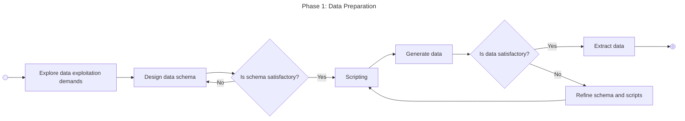
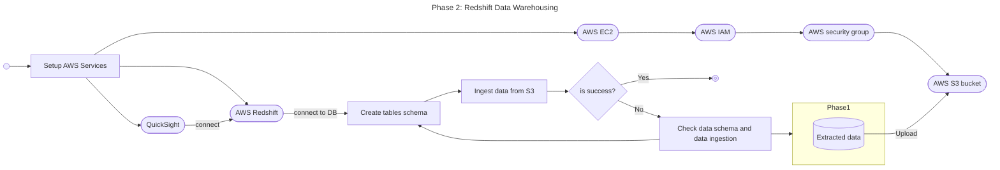
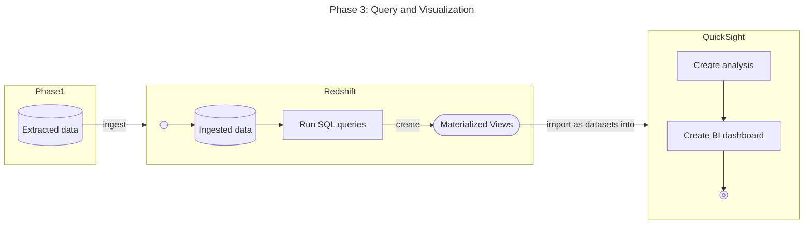

# DATA ENGINEERING REPORT LAYOUT

## I. Giới thiệu

> Trình bày **ngữ cảnh** của đề tài.<br>
> Trình bày **các bên liên quan** đến đề tài (đặc biệt là người dùng), cùng với **các yêu cầu nghiệp vụ** và **nhu cầu khai thác dữ liệu**, định hình ứng dụng khai thác dữ liệu từ lĩnh vực ứng dụng được yêu cầu. <br>

Theo [Statista](https://www.statista.com/statistics/379046/worldwide-retail-e-commerce-sales/), và nhiều trang đưa tin về các số liệu dự báo liên quan đến thị trường thương mại điện tử năm nay (2025) và những năm kế tiếp (đến 2030), ngành Thương mại điện tử (E-Commerce) nói chung và bán lẻ nói riêng sẽ đạt doanh thu lên đến 8 trăm tỉ đô.

Nên có thể nói, thị trường Thương mại điện tử vẫn còn là một thị trường lớn, chưa hạ nhiệt bất kể nền kinh tế thị trường toàn thế giới có nhiều biến động.

Do đó, với những giá trị doanh số ước tính đó, những doanh nghiệp trong ngành Thương mại điện tử cũng phải đối mặt với nhiều thách thức và vấn đề. Không chỉ liên quan đến vận hành các sàn giao dịch, điều phối logistic, giao nhận các đơn hàng, các chiến dịch địa phương,... Bên cạnh việc vận hành hệ thống cho các xử lý giao dịch, cập nhật dữ liệu liên tục, lớn, mà còn có thể gặp nhiều thách thức trong việc xử lý các dữ liệu lớn, để qua đó không ngừng cung cấp nhiều hoạt động khác cho khách hàng, tìm hiểu xu hướng thị trường, quản lý chất lượng sản phẩm, phát hiện và xử lý các bất thường trong giao dịch,... từ nguồn dữ liệu đến từ hệ thống được vận hành và chạy liên tục.

Qua đó, lấy bối cảnh là một doanh nghiệp vận hành một sàn thương mại điện tử, nơi có tốc độ data-scale lớn, các dữ liệu tập trung để phân tích nhiều, nên rất cần một hệ thống có thể đáp ứng được tốc độc truy vấn khổng lồ mà nhiều Hệ quản trị cơ sở dữ liệu quan hệ - Relational Database Management System (RDBMS) khó đáp ứng được - là một kho dữ liệu (Data Warehouse) như Amazon Redshift.

Amazon Redshift là một trong những lựa chọn tuyệt vời và thích hợp để xử lý bài toán phân tích dữ liệu lớn, hỗ trợ doanh nghiệp đưa ra các quyết định dựa trên dữ liệu (data-driven) với độ trễ thấp, độ ổn định cao, và khả năng truy vấn mạnh mẽ, đặc biệt khi xử lý hàng triệu, thậm chí hàng trăm triệu bản ghi.

Với bối cảnh đó, các bên liên quan (trực tiếp hoặc gián tiếp) tham gia vào hệ thống xử lý và phân tích dữ liệu trên sàn thương mại điện tử này (sau đây gọi tắt là hệ thống), bao gồm các bên với yêu cầu nghiệp vụ như bảng bên dưới:

| Stakeholders             | Vai trò                                             | Yêu cầu nghiệp vụ |
| ------------------------ | --------------------------------------------------- | ----------------- |
| Data Analysis            | Phân tích dữ liệu (chính)                           | xxx               |
| Business Manager         | Quyết định chiến lược                               | xxx               |
| Operation Team           | Vận kho, điều phối quản lý sản phẩm                 | xxx               |
| Khách hàng<br>(Consumer) | Người tham gia mua sắm<br>và thực hiện giao dịch    | xxx               |
| Nhà bán hàng<br>(Seller) | Đăng ký và cung cấp hàng hóa<br>cho nhu cầu mua sắm | xxx               |
| Developer team           | Phát triển và bảo trì hệ thống                      | xxx               |

Từ đó, hệ thống muốn trình bày và đưa ra một số nhu cầu liên quan đến khai thác dữ liệu, có liên quan và được sử dụng trực tiếp hoặc gián tiếp từ các bên liên quan kể trên như:

| #   | Nhu cầu KTDL                         | Mô tả                                                                 |
| --- | ------------------------------------ | --------------------------------------------------------------------- |
| 1   | Phân tích doanh thu YoY hoặc MoM     | Theo dõi doanh thu ngày/tháng/năm để điều chỉnh chiến dịch marketing. |
| 2   | Phân tích và quản lý tồn kho         | Phát hiện sản phẩm sắp hết, tự động cảnh báo restock.                 |
| 3   | Phân tích hiệu suất bán hàng         | Đánh giá seller nào bán tốt để ưu tiên hiển thị.                      |
| 4   | Phân tích và báo cáo theo địa lý     | Xác định khu vực mua nhiều để tối ưu logistic & quảng cáo địa phương. |
| 5   | Phân tích đánh giá sản phẩm          | Phát hiện sản phẩm rating thấp để cải thiện chất lượng.               |
| 6   | Phân tích hiểu quả danh mục sản phẩm | Quyết định mở rộng danh mục nào.                                      |

## II. Nguồn dữ liệu

### 2.1. Nguồn dữ liệu dự kiến

#### 2.1.1. Tiêu chí lựa chọn

Để đảm bảo tính khả thi và hiệu quả của dự án, nguồn dữ liệu được lựa chọn dựa trên các tiêu chí sau:

1. **Tính đại diện (Representative)**: Dữ liệu phải phản ánh đầy đủ các hoạt động nghiệp vụ thực tế của một sàn thương mại điện tử, bao gồm:

   - Hoạt động của người dùng (consumers và sellers)
   - Giao dịch mua bán, thanh toán
   - Quản lý sản phẩm và tồn kho
   - Đánh giá và phản hồi từ khách hàng

2. **Tính toàn vẹn (Integrity)**: Dữ liệu phải đảm bảo tính toàn vẹn tham chiếu giữa các bảng, phù hợp với các ràng buộc nghiệp vụ thực tế.

3. **Khả năng mở rộng (Scalability)**: Có thể sinh dữ liệu với quy mô lớn để mô phỏng môi trường production thực tế và kiểm tra hiệu năng của Data Warehouse.

4. **Tính đa dạng (Diversity)**: Dữ liệu bao gồm nhiều loại sản phẩm (verticals), nhiều khu vực địa lý, nhiều phương thức thanh toán để phục vụ các phân tích đa chiều.

5. **Tính nhất quán thời gian (Temporal Consistency)**: Dữ liệu phải có các mốc thời gian hợp lý để phân tích xu hướng theo thời gian (time-series analysis).

#### 2.1.2. Nguồn dữ liệu

Dữ liệu cho dự án được **tự sinh tạo (synthetic data)** với các thư viện python:

- **Faker library**: Sinh dữ liệu giả lập thực tế cho tên, địa chỉ, email, số điện thoại, văn bản mô tả, v.v.
- **Random & UUID modules**: Tạo các giá trị ngẫu nhiên, UUID cho primary keys
- **Datetime modules**: Sinh các mốc thời gian trong khoảng 1-3 năm gần đây

**Lý do sử dụng dữ liệu tự sinh:**

- Không có sẵn dataset E-commerce thực tế công khai với đầy đủ các thuộc tính cần thiết
- Kiểm soát hoàn toàn về quy mô, phân phối và đặc tính của dữ liệu
- Đảm bảo tuân thủ các quy định về bảo mật và quyền riêng tư (không sử dụng dữ liệu thật)
- Khả năng tái tạo (reproducible) với seed cố định để đảm bảo tính nhất quán
- File này được tái sử dụng qua nhiều lần generate để đảm bảo tính nhất quán của các danh mục

---

### 2.2. Các đặc điểm dữ liệu

#### 2.2.1. Tính chất của bộ dữ liệu

Bộ dữ liệu được thiết kế theo mô hình **Star Schema** (biến thể) phù hợp với Data Warehouse:

1. **Dimension Tables (Bảng chiều):**

   - `users`, `consumers`, `sellers`: Thông tin về các actor trong hệ thống
   - `verticals`: Danh mục sản phẩm
   - `address_books`: Địa chỉ giao hàng
   - `cards`: Phương thức thanh toán
   - `commodities`: Catalog sản phẩm

2. **Fact Tables (Bảng sự kiện):**

   - `orders`: Đơn hàng - fact table trung tâm
   - `order_commodities`: Sản phẩm trong đơn hàng
   - `transactions`: Giao dịch thanh toán
   - `reviews`: Đánh giá sản phẩm

3. **Bridge Tables (Bảng cầu nối):**
   - `seller_vertical`: Quan hệ nhiều-nhiều giữa sellers và verticals

**Đặc điểm về phân phối dữ liệu:**

- **Skewed distribution**: Một số sellers/products sẽ có nhiều đơn hàng hơn (phản ánh thực tế)
- **Time-series data**: Dữ liệu được phân bố theo thời gian (1-3 năm gần đây)
- **Geographic diversity**: Dữ liệu địa lý đa dạng với nhiều quốc gia, thành phố
- **Status distribution**: Các trạng thái đơn hàng phân bố theo tỷ lệ thực tế (delivered > shipped > inprogress > cancelled)

#### 2.2.2. Các thực thể dữ liệu chính

Hệ thống bao gồm 13 thực thể chính được tổ chức theo các nhóm:

**A. Nhóm User Management (Quản lý người dùng):**

1. **users** - Bảng base cho tất cả người dùng

   - Vai trò: Lưu thông tin chung (username, email, phone, status)
   - Khóa chính: `id` (UUID)
   - Đặc điểm: Sử dụng inheritance pattern với consumers và sellers

2. **consumers** - Hồ sơ người mua

   - Vai trò: Thông tin mở rộng của consumer (birthday, gender, customer_segment)
   - Khóa chính: `id` (FK đến users.id, quan hệ 1:1)
   - Đặc điểm: Chứa các trường denormalized (total_orders, total_spent)

3. **sellers** - Hồ sơ người bán
   - Vai trò: Thông tin mở rộng của seller (type, địa chỉ kinh doanh, rating_avg)
   - Khóa chính: `id` (FK đến users.id, quan hệ 1:1)
   - Đặc điểm: Chứa metrics kinh doanh (total_sales, total_orders)

**B. Nhóm Product Management (Quản lý sản phẩm):**

4. **verticals** - Danh mục sản phẩm

   - Vai trò: Phân loại sản phẩm theo ngành hàng (Electronics, Fashion, Food,...)
   - Khóa chính: `id` (UUID)
   - Đặc điểm: Dimension table nhỏ, DISTSTYLE ALL trong Redshift

5. **commodities** - Catalog sản phẩm

   - Vai trò: Thông tin chi tiết sản phẩm (SKU, price, cost_price, quantity)
   - Khóa chính: `id` (UUID)
   - Đặc điểm: Large dimension table, chứa thông tin tồn kho và pricing

6. **seller_vertical** - Quan hệ Seller-Vertical
   - Vai trò: Xác định seller kinh doanh trong các verticals nào
   - Khóa chính: Composite (`seller_id`, `vertical_id`)
   - Đặc điểm: Many-to-Many bridge table

**C. Nhóm Order Processing (Xử lý đơn hàng):**

7. **orders** - Đơn hàng

   - Vai trò: Core fact table, lưu thông tin đơn hàng
   - Khóa chính: `id` (UUID)
   - Đặc điểm:
     - Chứa denormalized fields cho delivery (city, country, coordinates)
     - Lưu timestamps cho funnel analysis (created_at, paid_at, shipped_at, delivered_at)
     - Chứa financial metrics (subtotal, tax, shipping, discount, total)

8. **order_commodities** - Chi tiết đơn hàng
   - Vai trò: Line items của order (quan hệ M:N giữa orders và commodities)
   - Khóa chính: Composite (`order_id`, `commodity_id`)
   - Đặc điểm: Lưu giá tại thời điểm đặt hàng (unit_price, unit_cost) cho historical accuracy

**D. Nhóm Payment Processing (Xử lý thanh toán):**

9. **cards** - Thẻ thanh toán

   - Vai trò: Lưu thông tin thẻ của consumers
   - Khóa chính: `id` (UUID)
   - Đặc điểm: Tokenized card data (tk field), hỗ trợ nhiều providers

10. **transactions** - Giao dịch thanh toán
    - Vai trò: Fact table cho payment transactions
    - Khóa chính: `id` (UUID)
    - Đặc điểm:
      - Hỗ trợ nhiều payment methods (card, COD, e-wallet)
      - Lưu gateway response codes và messages
      - Chứa metadata (IP address, user agent)

**E. Nhóm Customer Experience (Trải nghiệm khách hàng):**

11. **address_books** - Sổ địa chỉ

    - Vai trò: Lưu địa chỉ giao hàng của consumers
    - Khóa chính: `id` (UUID)
    - Đặc điểm:
      - Chứa coordinates (latitude, longitude) cho geo analysis
      - Support multiple addresses per consumer với is_default flag

12. **reviews** - Đánh giá sản phẩm

    - Vai trò: Fact table cho customer reviews
    - Khóa chính: `id` (UUID)
    - Đặc điểm:
      - One review per order (order_id UNIQUE)
      - Denormalized consumer_id và seller_id cho fast lookup
      - Rate từ 1-5 stars, support verified purchase flag

13. **Staging tables** - Bảng tạm cho ETL process

#### 2.2.3. 3Vs của dữ liệu

Phân tích theo mô hình **3Vs của Big Data** (Volume, Velocity, Variety):

**1. Volume (Khối lượng):**

- **Quy mô hiện tại (Demo):** ~500,000 bản ghi
- **Quy mô dự kiến (Production):**

  - 1 triệu users (900K consumers, 100K sellers)
  - 5 triệu commodities
  - 100 triệu orders/năm
  - 300 triệu order line items/năm
  - 80 triệu transactions/năm
  - 30 triệu reviews/năm

- **Kích thước lưu trữ ước tính:**

  - Raw data: ~100GB/năm (uncompressed)
  - Compressed trong Redshift: ~20-30GB/năm (với compression)
  - Aggregated tables: ~5GB

- **Tốc độ tăng trưởng:**
  - Orders: ~300,000 đơn/ngày (peak)
  - Data ingestion: ~2GB/ngày

**2. Velocity (Tốc độ):**

- **Batch processing:**
  - Orders data: Load hàng ngày (daily batch) từ OLTP database
  - Aggregations: Refresh mỗi 6-12 giờ
- **Near real-time processing:**
  - Inventory updates: Mỗi 15-30 phút
  - Sales dashboards: Refresh mỗi 5-10 phút
- **Stream processing (nếu mở rộng):**

  - Real-time order tracking
  - Fraud detection

- **Query velocity:**
  - Analytical queries: 1000-5000 queries/giờ
  - Dashboard queries: 100-500 concurrent users

**3. Variety (Đa dạng):**

- **Structured data (chiếm ~95%):**

  - Relational data phân bổ trong 13 bảng chính
  - Dữ liệu số: prices, quantities, ratings, metrics
  - Dữ liệu thời gian: timestamps cho lifecycle tracking
  - Dữ liệu địa lý: coordinates, cities, countries

- **Semi-structured data (chiếm ~5%):**
  - JSON fields trong gateway_response (có thể mở rộng)
  - Log data từ ETL processes

**Đánh giá chung:**

- Dự án hiện tại thuộc quy mô **Medium Data** (~500K records)
- Có tiềm năng scale lên **Big Data** (>100M records) trong production
- Redshift được chọn để chuẩn bị cho việc scale trong tương lai

#### 2.2.4. Giới hạn (ràng buộc) của giá trị

**A. Ràng buộc khóa (Key Constraints):**

1. **Primary Keys:**

   - Tất cả bảng có khóa chính (UUID hoặc composite key)
   - UUID v4 được sử dụng cho single-column primary keys
   - Composite keys cho junction tables (seller_vertical, order_commodities)

2. **Foreign Keys:**

   - Trong thiết kế logical: Đầy đủ FK constraints
   - Trong Redshift physical schema: **Một số FK được bỏ qua** (theo comment trong DBML lines 444-451)
   - Lý do: Redshift không enforce FK, và việc load data linh hoạt hơn
   - Giải pháp: Enforce referential integrity tại ETL layer

3. **Unique Constraints:**
   - `users.username`, `users.email`, `users.phone` - UNIQUE
   - `commodities.sku` - UNIQUE (mã SKU duy nhất)
   - `verticals.name` - UNIQUE
   - `reviews.order_id` - UNIQUE (một đơn hàng chỉ có một review)

**B. Ràng buộc giá trị (Value Constraints):**

1. **NOT NULL Constraints:**

   - Các trường bắt buộc: username, email, phone, name, price, quantity, order amounts
   - Một số trường optional: address_line_2, technical_info, guarantee_info, comment

2. **Default Values:**

   - Status fields: default 'active', 'draft' tùy theo context
   - Numeric fields: default 0 hoặc 0.0000
   - Boolean fields: default false
   - Timestamps: default `now()`

3. **Check Constraints (Logic - không enforce trong Redshift):**

   - `rate` trong reviews: 1-5
   - `exp_month` trong cards: 1-12
   - `exp_year` trong cards: >= 2024
   - `quantity`: >= 0
   - `price`: > 0
   - Financial amounts: >= 0

4. **Enum Constraints:**
   - Các trường enum được giới hạn trong danh sách giá trị cố định:
     - `status`: active, inactive, deleted
     - `order_status`: 8 giá trị (draft → done/cancelled/abandoned)
     - `trans_status`: 6 giá trị (draft → captured/failed/refunded)
     - `gender`: 4 giá trị
     - `commodity_status`: 4 giá trị
     - v.v. (xem section ENUMS trong DBML)

**C. Ràng buộc nghiệp vụ (Business Rules):**

1. **Order Lifecycle:**

   - `confirmed_at` >= `created_at`
   - `paid_at` >= `confirmed_at`
   - `shipped_at` >= `paid_at`
   - `delivered_at` >= `shipped_at`
   - `completed_at` >= `delivered_at`

2. **Financial Calculations:**

   - `total_amount` = `subtotal_amount` + `tax_amount` + `shipping_fee` - `discount_amount`
   - `line_total` = `quantity` \* `unit_price` - `discount_applied`
   - `cost_price` < `price` (để có lợi nhuận)

3. **Inventory Rules:**

   - `reserved_quantity` <= `quantity`
   - `quantity` + `reserved_quantity` >= 0
   - Alert khi `quantity` < `reorder_level`

4. **Rating Aggregations:**

   - `consumers.total_spent` = SUM(orders.total_amount WHERE status IN ('delivered', 'done'))
   - `commodities.rating_avg` = AVG(reviews.rate WHERE commodity_id = X)
   - `sellers.rating_avg` = AVG(reviews.rate WHERE seller_id = X)

5. **Customer Segmentation:**
   - VIP: total_spent >= $5,000
   - Regular: $1,000 <= total_spent < $5,000
   - Occasional: $100 <= total_spent < $1,000
   - One-time: total_spent < $100

**D. Ràng buộc độ dài (Length Constraints):**

| Field Type    | Max Length | Example Fields                       |
| ------------- | ---------- | ------------------------------------ |
| UUID          | 36 chars   | All ID fields                        |
| VARCHAR(15)   | 15         | phone                                |
| VARCHAR(50)   | 50         | city, province, SKU prefix           |
| VARCHAR(100)  | 100        | name, receiver_name, address_line_1  |
| VARCHAR(255)  | 255        | username, email, commodity.name      |
| VARCHAR(500)  | 500        | introduction                         |
| TEXT          | unlimited  | description, comment, technical_info |
| DECIMAL(10,4) | 10 digits  | prices, amounts                      |
| DECIMAL(12,4) | 12 digits  | consumers.total_spent                |
| DECIMAL(14,4) | 14 digits  | sellers.total_sales                  |
| DECIMAL(3,2)  | 3 digits   | rating_avg (range: 0.00 - 5.00)      |

#### 2.2.5. Lưu ý về value của các dữ liệu

**A. Dữ liệu có thể NULL:**

1. **Consumer Profile:**

   - `birthday`: NULL cho users không cung cấp
   - `customer_segment`: NULL cho consumers chưa có đơn hàng

2. **Seller Profile:**

   - `introduction`: NULL nếu chưa viết
   - `address`, `city`, `province`: NULL cho sellers online-only
   - `rating_avg`: NULL nếu chưa có reviews

3. **Commodity Details:**

   - `cost_price`: NULL nếu không tracking (ảnh hưởng profit analysis)
   - `description`, `technical_info`, `guarantee_info`: NULL (optional fields)
   - `manufacturer_name`: NULL cho handmade/unknown brands
   - `weight_kg`: NULL (ảnh hưởng shipping calculation)
   - `rating_avg`: NULL nếu chưa có reviews

4. **Order Timestamps:**

   - `confirmed_at`: NULL cho orders với status = 'draft'
   - `paid_at`: NULL cho orders chưa thanh toán
   - `shipped_at`, `delivered_at`, `completed_at`: NULL tùy theo order status
   - `days_to_ship`, `days_to_deliver`: NULL (derived fields)

5. **Order Address:**

   - `delivery_postal_code`: NULL (một số quốc gia không có postal code)
   - `delivery_latitude`, `delivery_longitude`: NULL nếu không geocoding

6. **Transaction Fields:**

   - `card_id`: NULL cho non-card payments (COD, bank transfer)
   - `authorized_at`, `completed_at`: NULL tùy theo trans_status
   - `gateway_transaction_id`, `gateway_response_code`, `gateway_response_message`: NULL cho COD

7. **Review Fields:**
   - `commodity_id`: NULL nếu review cho cả order (không specific product)
   - `comment`: NULL (chỉ rating không có text)
   - `published_at`: NULL cho reviews với status != 'published'

**Impact của NULL values:**

- **Analytical queries:** Cần xử lý NULL bằng COALESCE, NULLIF, IS NULL/IS NOT NULL
- **Aggregations:** AVG, SUM tự động bỏ qua NULL (nhưng cần cẩn thận với COUNT)
- **Joins:** NULL không match được với bất kỳ giá trị nào (kể cả NULL khác)

**B. Dữ liệu đa giá trị (Multi-valued Attributes):**

Trong thiết kế hiện tại, **không có cột nào lưu đa giá trị** (tuân thủ 1NF - First Normal Form).

Các quan hệ đa giá trị được normalize thành bảng riêng:

1. **Seller ↔ Verticals:** Một seller có thể bán nhiều verticals

   - Solution: Bảng `seller_vertical` (junction table)
   - Query: JOIN để lấy danh sách verticals của seller

2. **Order ↔ Commodities:** Một order có thể có nhiều commodities

   - Solution: Bảng `order_commodities` với quantity
   - Query: JOIN để lấy line items của order

3. **Consumer ↔ Addresses:** Một consumer có thể có nhiều addresses

   - Solution: Bảng `address_books` với is_default flag
   - Query: JOIN hoặc subquery để lấy default address

4. **Consumer ↔ Cards:** Một consumer có thể có nhiều cards
   - Solution: Bảng `cards` với is_default flag
   - Query: JOIN hoặc subquery để lấy default card

**C. Dữ liệu Denormalized:**

Để tối ưu query performance, một số metrics được denormalize:

1. **Trong `consumers`:**

   - `total_orders`: Computed từ orders table
   - `total_spent`: SUM(orders.total_amount)
   - `customer_segment`: Derived từ total_spent

2. **Trong `sellers`:**

   - `total_orders`: COUNT(orders)
   - `total_sales`: SUM(orders.total_amount)
   - `rating_avg`: AVG(reviews.rate)

3. **Trong `commodities`:**

   - `total_sold`: SUM(order_commodities.quantity)
   - `review_count`: COUNT(reviews)
   - `rating_avg`: AVG(reviews.rate)

4. **Trong `orders`:**

   - `delivery_city`, `delivery_country`: Copied từ address_books
   - `delivery_latitude`, `delivery_longitude`: Copied từ address_books

5. **Trong `reviews`:**
   - `consumer_id`, `seller_id`: Denormalized từ orders

**Ưu điểm và nhược điểm của Denormalization:**

- ✅ **Ưu:** Tăng tốc độ của truy vấn, ít phải gọi các lệnh JOIN
- ❌ **Nhược điểm:** dữ liệu có thể xuất hiện ở nhiều chỗ, có khả năng mất đồng bộ
- 🔄 **Solution:** Cập nhật các dữ liệu denormalized thường xuyên

**D. Dữ liệu có ràng buộc đặc biệt:**

1. **Encrypted/Hashed Data:**

   - `cards.tk`: chứa đoạn hash của card number của người dùng (SHA-256)
   - Production cần thêm: Personal Identifiable Information (PII) encryption

2. **Temporal Data:**

   - Tất cả timestamps sử dụng format: `YYYY-MM-DD HH:MI:SS`
   - Dates sử dụng format: `YYYY-MM-DD`
   - Timezone: Giả định UTC trong demo (production cần timezone-aware)

3. **Geographic Data:**

   - Latitude: -90 đến 90
   - Longitude: -180 đến 180
   - Precision: 7 decimal places (~11mm accuracy)

4. **Financial Data:**

   - Currency: USD (mặc định)
   - Precision: 4 decimal places (0.0001)
   - Rounding: ROUND_HALF_UP

5. **Identifiers:**
   - UUID: Version 4 (random)
   - SKU: Format PREFIX-NNNNNN (e.g., ELEC-123456)
   - Transaction IDs: Format GTW-NNNNNNNNN

---

### 2.3. Trình bày về hệ quản trị cơ sở dữ liệu (DBMS)

#### 2.3.1. Các kỹ thuật dữ liệu được sử dụng

**A. Primary Keys (PK):**

1. **UUID-based Primary Keys:**

   - Hầu hết bảng sử dụng UUID v4 làm primary key
   - **Ưu điểm:**
     - Globally unique: Không conflict khi merge data từ nhiều sources
     - Generated client-side: Không phụ thuộc vào database sequence
     - Security: Không lộ thông tin về số lượng records
   - **Nhược điểm:**
     - Kích thước lớn (36 characters): Tốn storage và memory
     - Random: Không có locality, index fragmentation
     - Redshift: Sử dụng RAW hoặc LZO compression để giảm storage

2. **Composite Primary Keys:**
   - `seller_vertical`: (seller_id, vertical_id)
   - `order_commodities`: (order_id, commodity_id)
   - **Ưu điểm:**
     - Natural keys cho junction tables
     - Enforce uniqueness của relationship
   - **Lưu ý trong Redshift:**
     - PK không được enforce (chỉ metadata cho optimizer)
     - Cần ensure uniqueness tại ETL layer

**B. Foreign Keys (FK):**

1. **Trong Logical Design:**

   - Đầy đủ FK constraints được định nghĩa trong DBML
   - Cascade rules: DELETE CASCADE hoặc RESTRICT tùy theo business logic
   - Quan hệ 1:1, 1:N, M:N đều có FK

2. **Trong Redshift Physical Schema:**

   - FK **không được enforce** (Redshift limitation)
   - FK được define như metadata cho query optimizer
   - **Referential integrity được ensure bởi:**
     - Data validation trong ETL pipeline
     - Application-level checks
     - Periodic integrity check jobs

3. **Ví dụ FK relationships:**
   - `consumers.id` → `users.id` (1:1 inheritance)
   - `orders.consumer_id` → `consumers.id` (1:N)
   - `order_commodities.order_id` → `orders.id` (M:N via junction)

**C. Sort Keys (SORTKEY):**

- Tương tự clustered index, dữ liệu được sắp xếp vật lý theo sort key
- **Compound sort key:** Thứ tự cột quan trọng (dùng cho prefix matching)
- **Interleaved sort key:** Equal weight cho mọi cột (dùng cho multi-column filtering)

**Ví dụ trong schema:**

- `orders`: SORTKEY (created_at, status)

  - Query WHERE created_at BETWEEN ... AND ... → Fast range scan
  - Query WHERE status = 'delivered' → Zone map filtering

- `commodities`: SORTKEY (vertical_id, created_at)

  - Query: Browse products by category, sorted by newest → Fast

- `transactions`: SORTKEY (created_at, status)

  - Time-series queries → Fast

- `reviews`: SORTKEY (created_at, rate)
  - Recent reviews, filter by rating → Fast

**D. Distribution Keys (DISTKEY):**

- Xác định cách data được phân tán trên các nodes
- **DISTKEY strategies:**

**a) DISTSTYLE KEY (phân tán theo column):**

- `orders`: DISTKEY consumer_id

  - Reason: Most queries join với consumers
  - Orders của cùng consumer nằm cùng node → Local join

- `transactions`: DISTKEY order_id

  - Reason: Collocate với orders table → Local join

- `order_commodities`: DISTKEY order_id

  - Reason: Collocate với orders table → Local join

- `commodities`: DISTKEY seller_id

  - Reason: Seller analytics queries → Local aggregation

- `cards`: DISTKEY consumer_id

  - Reason: Collocate với consumers table → Local join

- `address_books`: DISTKEY user_id
  - Reason: Collocate với consumers → Local join

**b) DISTSTYLE ALL (replicate toàn bộ):**

- `users`, `consumers`, `sellers`, `verticals`
- Reason: Small dimension tables, full copy trên mọi node
- Benefit: Joins không cần redistribution → Very fast

**c) DISTSTYLE EVEN (round-robin):**

- Default nếu không specify
- Dữ liệu phân bố đều, dùng khi không có join pattern rõ ràng

**E. Partitioning:**

Redshift **không có native partitioning** như PostgreSQL. Strategies thay thế:

1. **Time-based table splitting:**

   - `orders_2024`, `orders_2025`, ...
   - Query: UNION ALL views
   - Trade-off: Query complexity vs performance

2. **External tables với S3:**

   - Partition data trong S3 (Hive-style partitioning)
   - Query qua Redshift Spectrum
   - Cost-effective cho cold data

3. **Date range filtering với Sort Key:**
   - Sort by date column
   - Zone maps automatically skip irrelevant blocks
   - Simpler than manual partitioning

**F. Denormalization Techniques:**

1. **Pre-aggregated Tables:**

   - Materialized aggregations cho common queries
   - Ví dụ: daily_sales_summary, monthly_revenue_by_vertical
   - Refresh: Scheduled jobs (dbt, Airflow)

2. **Flattened Dimensions:**

   - Copy frequently-used dimension attributes vào fact table
   - Ví dụ: delivery_city, delivery_country trong orders
   - Trade-off: Storage vs JOIN elimination

3. **Star Schema Design:**
   - Central fact table (orders) surrounded by dimensions
   - Optimized cho OLAP queries
   - Redshift optimizer ưu tiên star join patterns

#### 2.3.2. Phân tích EER (Enhanced Entity-Relationship)

**A. Phân loại thực thể theo độ mạnh:**

**1. Strong Entities (Thực thể mạnh):**

Tồn tại độc lập, có khóa chính riêng:

- **users** - Thực thể gốc cho tất cả người dùng

  - PK: `id` (UUID)
  - Tồn tại độc lập, không phụ thuộc thực thể khác

- **verticals** - Danh mục sản phẩm

  - PK: `id` (UUID)
  - Master data, tồn tại độc lập

- **orders** - Đơn hàng (Core fact table)

  - PK: `id` (UUID)
  - Có sử dụng FK đến consumers và sellers

- **transactions** - Giao dịch thanh toán

  - PK: `id` (UUID)
  - Có FK đến orders

- **reviews** - Đánh giá sản phẩm

  - PK: `id` (UUID)
  - Có FK đến orders

- **commodities** - Sản phẩm

  - PK: `id` (UUID)
  - Mặc dù thuộc về seller, nhưng tồn tại độc lập với lifecycle riêng

- **cards** - Thẻ thanh toán

  - PK: `id` (UUID)
  - Thuộc về consumer, tuy nhiên vẫn có identity riêng

- **address_books** - Địa chỉ
  - PK: `id` (UUID)
  - Thuộc về user nhưng có identity riêng

**2. Weak Entities (Thực thể yếu):**

Phụ thuộc vào thực thể khác, khóa chính bao gồm khóa ngoại:

- **consumers** - Hồ sơ người mua

  - PK: `id` (cũng là FK đến users.id)
  - **Phụ thuộc:** users (quan hệ ISA/inheritance)
  - **Existence dependency:** Không thể tồn tại nếu không có users
  - **Identifying relationship:** consumer_user (1:1)

- **sellers** - Hồ sơ người bán

  - PK: `id` (cũng là FK đến users.id)
  - **Phụ thuộc:** users (quan hệ ISA/inheritance)
  - **Existence dependency:** Không thể tồn tại nếu không có users
  - **Identifying relationship:** seller_user (1:1)

- **seller_vertical** - Junction table

  - PK: (`seller_id`, `vertical_id`) - Composite key gồm 2 FK
  - **Phụ thuộc:** sellers và verticals
  - **Existence dependency:** Phải có cả seller và vertical
  - **Identifying relationship:** M:N relationship

- **order_commodities** - Sản phẩm trong đơn hàng
  - PK: (`order_id`, `commodity_id`) - Composite key gồm 2 FK
  - **Phụ thuộc:** orders và commodities
  - **Existence dependency:** Phải có order
  - **Identifying relationship:** M:N relationship via junction

**B. Ràng buộc tham gia (Participation Constraints):**

**1. Total Participation (Mandatory, ký hiệu: double line):**

Entity bắt buộc phải tham gia vào relationship:

- **consumers** → **address_books**: Total participation

  - Mỗi consumer **PHẢI có ít nhất 1 địa chỉ** để đặt hàng
  - Business rule: Consumer phải setup address trước khi order
  - DB enforcement: Application-level check

- **orders** → **consumer**: Total participation

  - Mỗi order **PHẢI thuộc về 1 consumer**
  - `orders.consumer_id` NOT NULL

- **orders** → **seller**: Total participation

  - Mỗi order **PHẢI thuộc về 1 seller**
  - `orders.seller_id` NOT NULL

- **commodities** → **seller**: Total participation

  - Mỗi commodity **PHẢI thuộc về 1 seller**
  - `commodities.seller_id` NOT NULL

- **commodities** → **vertical**: Total participation

  - Mỗi commodity **PHẢI thuộc về 1 vertical**
  - `commodities.vertical_id` NOT NULL

- **transactions** → **order**: Total participation
  - Mỗi transaction **PHẢI liên kết với 1 order**
  - `transactions.order_id` NOT NULL

**2. Partial Participation (Optional, ký hiệu: single line):**

Entity có thể không tham gia vào relationship:

- **consumers** → **cards**: Partial participation

  - Consumer có thể không có thẻ (dùng COD, bank transfer)
  - Một số consumers chưa setup payment method

- **orders** → **transactions**: Partial participation

  - Orders với status='draft' chưa có transaction
  - Orders cancelled cũng có thể không có transaction

- **orders** → **reviews**: Partial participation

  - Không phải order nào cũng có review
  - Chỉ ~30% delivered orders có review

- **transactions** → **card**: Partial participation

  - Transactions không dùng card (COD, bank transfer) có `card_id` = NULL
  - `transactions.card_id` nullable

- **reviews** → **commodity**: Partial participation
  - Review có thể cho cả order (không specify commodity)
  - `reviews.commodity_id` nullable

**C. Ràng buộc cardinality (Cardinality Constraints):**

**1. One-to-One (1:1):**

- **users** ↔ **consumers**

  - Mỗi consumer là 1 user, mỗi user (consumer) chỉ có 1 consumer profile
  - Implementation: consumers.id = FK và PK

- **users** ↔ **sellers**

  - Mỗi seller là 1 user, mỗi user (seller) chỉ có 1 seller profile
  - Implementation: sellers.id = FK và PK

- **orders** ↔ **reviews**
  - Mỗi order có tối đa 1 review (order_id UNIQUE trong reviews)
  - Business rule: One review per order

**2. One-to-Many (1:N):**

- **consumers** → **address_books** (1:N)

  - Mỗi consumer có nhiều addresses
  - Mỗi address thuộc về 1 consumer
  - FK: address_books.user_id → consumers.id

- **consumers** → **cards** (1:N)

  - Mỗi consumer có nhiều cards
  - Mỗi card thuộc về 1 consumer
  - FK: cards.consumer_id → consumers.id

- **consumers** → **orders** (1:N)

  - Mỗi consumer có nhiều orders
  - Mỗi order của 1 consumer
  - FK: orders.consumer_id → consumers.id

- **sellers** → **orders** (1:N)

  - Mỗi seller nhận nhiều orders
  - Mỗi order từ 1 seller
  - FK: orders.seller_id → sellers.id

- **sellers** → **commodities** (1:N)

  - Mỗi seller có nhiều commodities
  - Mỗi commodity của 1 seller
  - FK: commodities.seller_id → sellers.id

- **verticals** → **commodities** (1:N)

  - Mỗi vertical có nhiều commodities
  - Mỗi commodity thuộc 1 vertical
  - FK: commodities.vertical_id → verticals.id

- **orders** → **transactions** (1:N)

  - Mỗi order có nhiều transactions (refunds, installments)
  - Mỗi transaction của 1 order
  - FK: transactions.order_id → orders.id

- **cards** → **transactions** (1:N)

  - Mỗi card dùng cho nhiều transactions
  - Mỗi transaction dùng 1 card
  - FK: transactions.card_id → cards.id

- **consumers** → **reviews** (1:N) [Denormalized]

  - FK: reviews.consumer_id → consumers.id

- **sellers** → **reviews** (1:N) [Denormalized]

  - FK: reviews.seller_id → sellers.id

- **commodities** → **reviews** (1:N)
  - FK: reviews.commodity_id → commodities.id

**3. Many-to-Many (M:N):**

- **sellers** ↔ **verticals** (M:N)

  - Mỗi seller bán trong nhiều verticals
  - Mỗi vertical có nhiều sellers
  - Bridge table: seller_vertical (seller_id, vertical_id)

- **orders** ↔ **commodities** (M:N)
  - Mỗi order có nhiều commodities (line items)
  - Mỗi commodity xuất hiện trong nhiều orders
  - Bridge table: order_commodities (order_id, commodity_id, quantity, ...)

**D. Ràng buộc đặc biệt (Specialized Constraints):**

**1. Disjoint Constraint (ISA hierarchy):**

- **users** có 2 subtypes: **consumers** và **sellers**
- **Disjoint:** Một user không thể vừa là consumer vừa là seller
  - (Trong thiết kế này - có thể thay đổi trong tương lai)
- **Total specialization:** Mỗi user phải là consumer HOẶC seller
  - Implementation: Application-level check

**Diagram:**

```
         users
        /     \
       /       \
consumers     sellers
   (disjoint, total)
```

**2. Aggregation (Ternary Relationship):**

- **reviews** aggregates relationship giữa (order, commodity, consumer)
  - Review không chỉ về commodity, mà về commodity trong context của order cụ thể
  - Denormalized consumer_id và seller_id để fast lookup

**3. Recursive Relationship:**

Không có trong schema hiện tại, nhưng có thể mở rộng:

- **users** → **users** (referral program)
- **verticals** → **verticals** (category hierarchy)

**E. Ràng buộc nghiệp vụ phức tạp:**

**1. Multi-table Constraints:**

- Order status lifecycle:

  ```
  IF orders.status = 'shipped'
  THEN orders.shipped_at IS NOT NULL
  AND orders.paid_at IS NOT NULL
  ```

- Transaction consistency:
  ```
  IF transactions.status = 'captured'
  THEN orders.status IN ('inprogress', 'shipped', 'delivered', 'done')
  ```

**2. Derived Attributes:**

- `consumers.customer_segment` ← derived từ `total_spent`
- `orders.days_to_ship` ← derived từ `shipped_at - paid_at`
- `commodities.rating_avg` ← derived từ AVG(reviews.rate)

**3. Temporal Constraints:**

- Order timestamps phải có thứ tự logic
- Review timestamp phải sau order delivered_at
- Card expiration: `(exp_year, exp_month)` > current date

**F. ER Diagram Notation Summary:**

| Element                  | Notation         | Example                   |
| ------------------------ | ---------------- | ------------------------- |
| Strong entity            | Rectangle        | users, orders             |
| Weak entity              | Double rectangle | consumers, sellers        |
| Relationship             | Diamond          | places (consumer-order)   |
| Identifying relationship | Double diamond   | ISA (user-consumer)       |
| Attribute                | Oval             | name, email               |
| Key attribute            | Underlined oval  | id                        |
| Derived attribute        | Dashed oval      | customer_segment          |
| Multi-valued attribute   | Double oval      | (none in current design)  |
| Total participation      | Double line      | order → consumer          |
| Partial participation    | Single line      | order → review            |
| Cardinality              | 1, N, M          | consumer (1) → orders (N) |

**Tham khảo ERD diagram:** [e_commerce_redshift.dbml](../dbml/e_commerce_redshift.dbml)

## III. Giải pháp kỹ thuật dữ liệu

> Trình bày các giải pháp kỹ thuật dữ liệu, liên quan và dựa trên các nhu cầu khai thác dữ liệu và đặc tính của dữ liệu ở 2 phần trên. <br>
> Dự đoán sẽ trình bày cách phân tích yêu cầu dữ liệu, để thiết kế các câu truy vấn. <br>
>
> Giới thiệu ít nhất 1 giải pháp thay thế (đối sánh). <br>

Giải pháp kỹ thuật dữ liệu được xây dựng trên nền tảng kho dữ liệu đám mây **Amazon Redshift**, một hệ thống quản lý dữ liệu phân tích được tối ưu hóa cho quy mô lớn. Theo nguyên tắc cơ bản của kỹ thuật dữ liệu, Redshift hỗ trợ mô hình data warehousing bằng cách tách biệt dữ liệu giao dịch (OLTP - Online Transaction Processing) khỏi dữ liệu phân tích (OLAP), giúp tránh tải nặng trên hệ thống vận hành hàng ngày. Lược đồ star schema trong tệp dbml – với bảng fact trung tâm như orders và transactions, kết nối với các bảng dimension như consumers, sellers, và commodities – thể hiện rõ nguyên tắc này: fact tables lưu trữ các chỉ số đo lường (metrics) như doanh thu và số lượng đơn hàng, trong khi dimension tables cung cấp ngữ cảnh (context) như thông tin khách hàng hoặc sản phẩm.

- **Quy trình ETL**: Dữ liệu được trích xuất (Extract) từ nguồn thô như file CSV trên S3, biến đổi (Transform) để làm sạch và denormalize (ví dụ: tính toán total_spent hoặc rating_avg để giảm join phức tạp), rồi tải (Load) vào Redshift qua lệnh COPY. Nguyên tắc ETL cơ bản đảm bảo dữ liệu nhất quán và sẵn sàng cho phân tích, tránh lỗi như duplicate records bằng cách sử dụng trigger hoặc lập lịch VACUUM/ANALYZE định kỳ.

- **Lưu trữ và phân bố dữ liệu**: Redshift áp dụng lưu trữ cột (columnar storage) – một kỹ thuật fundamental giúp truy vấn nhanh hơn bằng cách chỉ đọc cột cần thiết, thay vì toàn bộ hàng như trong RDBMS truyền thống. DISTKEY và SORTKEY được cấu hình để phân tán dữ liệu theo các trường thường join (như consumer_id), giảm thời gian shuffle dữ liệu trong truy vấn phân tán, phù hợp với nguyên tắc MPP (Massively Parallel Processing) để xử lý dữ liệu lớn.

- **Xử lý truy vấn OLAP**: Các truy vấn tổng hợp (aggregation) như SUM, COUNT, AVG được hỗ trợ hiệu quả nhờ SORTKEY trên created_at, cho phép phân tích thời gian (time-series analysis) mà không cần index phức tạp. Điều này phù hợp với nguyên tắc OLAP, nơi ưu tiên truy vấn đa chiều để hỗ trợ báo cáo kinh doanh, như phân tích doanh thu theo thời gian hoặc địa lý.

- **Tích hợp với mục tiêu tổ chức**: Trong ngữ cảnh thương mại điện tử, giải pháp này hỗ trợ data-driven decisions bằng cách cung cấp độ trễ thấp (low latency) cho các truy vấn phức tạp, giúp các bên liên quan như quản lý kinh doanh và đội ngũ vận hành khai thác dữ liệu thời gian thực. Ví dụ, denormalized fields giảm nhu cầu tính toán lặp lại, phù hợp với nguyên tắc data modeling để tối ưu hiệu suất.

Giải pháp này đảm bảo tính mở rộng (scalability) cho dữ liệu lên đến hàng trăm triệu bản ghi, với chi phí hợp lý dựa trên mô hình pay-per-use của AWS.

#### Giải Pháp Thay Thế: So Sánh Với Google BigQuery

Để đối sánh, một giải pháp thay thế là **Google BigQuery**, một kho dữ liệu đám mây không máy chủ (serverless) cũng tập trung vào phân tích dữ liệu lớn. BigQuery sử dụng kiến trúc columnar storage tương tự Redshift nhưng khác biệt ở mô hình tính toán: BigQuery tách biệt lưu trữ và tính toán, cho phép scale độc lập mà không cần quản lý cluster như Redshift.

- **Quy trình ETL**: BigQuery hỗ trợ tải dữ liệu qua lệnh LOAD DATA từ GCS (tương tự S3), nhưng tích hợp tốt hơn với Google Cloud ecosystem. So với Redshift's COPY, BigQuery tự động infer schema và xử lý lỗi tốt hơn, giảm công sức transform thủ công – phù hợp cho ETL fundamental khi dữ liệu thô đa dạng.

- **Lưu trữ và phân bố**: BigQuery không yêu cầu DISTKEY/SORTKEY thủ công; thay vào đó, sử dụng clustering và partitioning tự động dựa trên thời gian hoặc địa lý, giản hóa quản lý so với Redshift. Tuy nhiên, Redshift có lợi thế trong MPP cho truy vấn join nặng, trong khi BigQuery ưu tiên serverless để tránh downtime.

- **Xử lý truy vấn OLAP**: Cả hai hỗ trợ SQL chuẩn, nhưng BigQuery tích hợp ML qua BigQuery ML (ví dụ: CREATE MODEL cho dự báo doanh thu), dễ dàng hơn Redshift ML. Đối với time-series analysis, BigQuery's window functions hiệu quả tương đương, nhưng chi phí dựa trên byte scanned có thể cao hơn nếu truy vấn không tối ưu.

## IV. Công nghệ quản lý dữ liệu

> Trình bày công nghệ được phân công cho quản lý dữ liệu, công nghệ tự chọn cho xử lý dữ liệu, và các dự định khai thác công nghệ cho ứng dụng. <br>

### IV.1. Công nghệ quản lý dữ liệu

> Trình bày cơ bản về Redshift

### IV.2. Công nghệ xử lý dữ liệu

> Dữ liệu được xử lý bằng script và code python trước khi được xuất ra csv để upload lên S3 và ingest vào Redshift Database

### IV.3. Các dự định khai thác công nghệ cho ứng dụng

#### IV.3.1. Phân Tích Doanh Thu Theo Thời Gian

**Mục tiêu tổ chức**:
Theo dõi doanh thu theo ngày/tháng/năm để dự báo xu hướng và tối ưu hóa chiến dịch tiếp thị. <br>

**Kỹ thuật dữ liệu**:
Tổng hợp (SUM, COUNT, AVG) với nhóm theo thời gian; join bảng fact để lọc giao dịch hợp lệ. <br>

**Đầu vào**:

- Dữ liệu từ bảng orders (total_amount, created_at) và transactions (status).
- ETL: Sử dụng lệnh COPY tải file CSV từ S3, xử lý thời gian theo định dạng UTC.

**Đầu ra**:
Bảng kết quả với tháng, doanh thu, số đơn hàng, giá trị trung bình – xuất ra CSV cho công cụ BI. <br>

**Quy trình thực hiện**:

- ETL: COPY dữ liệu thô từ S3 vào bảng orders và transactions, sử dụng lệnh COPY với tùy chọn IGNOREHEADER.
- Thực hiện truy vấn SQL để tổng hợp.
- Sau xử lý: Sử dụng Redshift ML để dự báo xu hướng doanh thu.

```sql
-- Doanh thu theo tháng (2025)
SELECT
    DATE_TRUNC('month', o.created_at) AS month,
    SUM(o.total_amount) AS revenue,
    COUNT(DISTINCT o.id) AS total_orders,
    AVG(o.total_amount) AS avg_order_value
FROM orders o
JOIN transactions t ON o.id = t.order_id
WHERE t.status = 'captured'
  AND o.created_at >= '2025-01-01'
GROUP BY 1
ORDER BY 1;
```

#### IV.3.2. Phân Tích Và Quản Lý Tồn Kho

**Mục tiêu tổ chức**:
Phát hiện sản phẩm sắp hết hàng để tránh mất doanh thu và duy trì sự hài lòng khách hàng.

**Kỹ thuật dữ liệu**:
Phép toán trừ trên trường denormalized; lọc theo ngưỡng.

**Đầu vào**:

- Bảng commodities (quantity, reserved_quantity, reorder_level).
- ETL: COPY file CSV từ S3, cập nhật hàng giờ qua lập lịch.

**Đầu ra**:
Danh sách sản phẩm cần tái nhập – kích hoạt cảnh báo qua SNS.

**Quy trình thực hiện**:

- ETL: COPY dữ liệu thô từ S3, tính toán available_stock trong quy trình tải.
- Thực hiện truy vấn lọc và sắp xếp.
- Tích hợp: Kết nối với hệ thống backend để gửi thông báo tự động cho nhà bán hàng.

```sql
SELECT
    c.sku, c.name,
    c.quantity - c.reserved_quantity AS available_stock,
    c.reorder_level, c.reorder_quantity
FROM commodities c
WHERE c.status = 'available'
  AND (c.quantity - c.reserved_quantity) <= c.reorder_level
ORDER BY available_stock;
```

#### IV.3.3. Phân Tích Hiệu Suất Bán Hàng

**Mục tiêu tổ chức**:
Đánh giá nhà bán hàng để ưu tiên hiển thị và cấp huy hiệu (ví dụ: top seller).

**Kỹ thuật dữ liệu**:
Join đa bảng (orders, sellers, users, order_commodities); tổng hợp doanh thu và số lượng.

**Đầu vào**:

- Dữ liệu từ sellers (rating_avg), orders (status, paid_at), order_commodities (line_total).
- ETL: COPY CSV từ S3, đảm bảo tính nhất quán dữ liệu.

**Đầu ra**: Danh sách top nhà bán hàng – sử dụng cho báo cáo dashboard.

**Quy trình thực hiện**:

- ETL: COPY dữ liệu thô từ S3 vào các bảng liên quan, xử lý null trong line_total.
- Thực hiện truy vấn với join và nhóm.
- Sau xử lý: Tích hợp với công cụ trực quan hóa để hiển thị biểu đồ.

```sql
-- Top 10 seller theo doanh thu tháng
SELECT
    s.id, u.username,
    SUM(oc.line_total) AS revenue,
    COUNT(DISTINCT o.id) AS orders,
    s.rating_avg
FROM sellers s
JOIN users u ON s.id = u.id
JOIN orders o ON o.seller_id = s.id
JOIN order_commodities oc ON o.id = oc.order_id
WHERE o.status IN ('delivered', 'done')
  AND o.paid_at >= DATE_TRUNC('month', CURRENT_DATE)
GROUP BY 1, 2, 5
ORDER BY revenue DESC
LIMIT 10;
```

#### IV.3.4. Phân Tích Và Báo Cáo Theo Địa Lý

**Mục tiêu tổ chức**:
Xác định khu vực có nhu cầu cao để tối ưu hóa logistics và quảng cáo địa phương.

**Kỹ thuật dữ liệu**:
Nhóm theo địa lý (delivery_city, delivery_country); tổng hợp doanh thu và phí vận chuyển.

**Đầu vào**:

- Bảng orders (delivery_city, delivery_province, total_amount).
- ETL: COPY CSV từ S3, bao gồm tọa độ địa lý.

**Đầu ra**:
Báo cáo doanh thu theo tỉnh/thành – hỗ trợ phân tích không gian.

**Quy trình thực hiện**:

- ETL: COPY dữ liệu thô từ S3, chuẩn hóa tên địa danh.
- Thực hiện truy vấn nhóm và sắp xếp.
- Sau xử lý: Kết nối với GIS để vẽ bản đồ.

```sql
-- Doanh thu theo tỉnh/thành phố, ví dụ: USA
SELECT
    o.delivery_city, o.delivery_province,
    COUNT(o.id) AS orders,
    SUM(o.total_amount) AS revenue,
    AVG(o.shipping_fee) AS avg_shipping
FROM orders o
WHERE o.delivery_country = 'USA'
  AND o.status IN ('delivered', 'done')
GROUP BY 1, 2
ORDER BY revenue DESC
LIMIT 20;
```

#### IV.3.5. Phân Tích Đánh Giá Sản Phẩm

**Mục tiêu tổ chức**:
Phát hiện sản phẩm có đánh giá thấp để cải thiện chất lượng và quản lý danh mục.

**Kỹ thuật dữ liệu**:
Join với reviews; tổng hợp trung bình đánh giá, lọc theo ngưỡng.

**Đầu vào**:

- Bảng commodities (rating_avg, review_count), reviews (rate, status).
- ETL: COPY CSV từ S3, cập nhật đánh giá mới.

**Đầu ra**:
Danh sách sản phẩm cần cải thiện – sử dụng cho quản lý sản phẩm.

**Quy trình thực hiện**:

- ETL: COPY dữ liệu thô từ S3, tính toán rating_avg denormalized.
- Thực hiện truy vấn với điều kiện.
- Sau xử lý: Phân tích cảm xúc từ comment sử dụng công cụ NLP.

```sql
-- Sản phẩm rating thấp nhất (vd: có ít nhất 10 review)
SELECT
    c.sku, c.name,
    c.rating_avg, c.review_count,
    ROUND(AVG(r.rate), 2) AS calculated_avg
FROM commodities c
LEFT JOIN reviews r ON c.id = r.commodity_id AND r.status = 'published'
WHERE c.review_count >= 10
GROUP BY 1, 2, 3, 4
HAVING c.rating_avg < 3.5
ORDER BY c.rating_avg;
```

#### IV.3.6. Phân Tích Hiệu Quả Danh Mục Sản Phẩm

**Mục tiêu tổ chức**:
Quyết định mở rộng danh mục dựa trên doanh thu và số lượng bán.

**Kỹ thuật dữ liệu**:
Join đa bảng (verticals, commodities, order_commodities, orders); tổng hợp doanh thu theo danh mục.

**Đầu vào**:

- Bảng verticals (name), commodities (vertical_id), order_commodities (line_total, quantity).
- ETL: COPY CSV từ S3, liên kết danh mục.

**Đầu ra**:
Báo cáo hiệu quả danh mục – hỗ trợ chiến lược sản phẩm.

**Quy trình thực hiện**:

- ETL: COPY dữ liệu thô từ S3, đảm bảo tính toàn vẹn tham chiếu.
- Thực hiện truy vấn tổng hợp.
- Sau xử lý: Dự báo xu hướng danh mục sử dụng mô hình thời gian.

```sql
-- Doanh thu theo danh mục
SELECT
    v.name AS vertical,
    COUNT(DISTINCT c.id) AS products,
    SUM(oc.line_total) AS revenue,
    SUM(oc.quantity) AS units_sold
FROM verticals v
JOIN commodities c ON v.id = c.vertical_id
JOIN order_commodities oc ON c.id = oc.commodity_id
JOIN orders o ON oc.order_id = o.id
WHERE o.status IN ('delivered', 'done')
GROUP BY 1
ORDER BY revenue DESC;
```

## V. Triển khai

> Trình bày cách triển khai ứng dụng dựa trên để tài lựa chọn và công nghệ được giao. <br>
> Bối cảnh: E-Commerce. <br>
> Công nghệ: Data Warehouse - Amazon Redshift. <br>
> Flowchart: [Overall Flow](../flowcharts/overall_flow.mmd)

Để triển khai các ứng dụng kết hợp với công nghệ lưu trữ dữ liệu - Amazon Redshift, trên thực tế, cần rất nhiều bước phức tạp để tiến hành và hỗ trợ. Từ việc phân tích các yêu cầu nghiệp vụ thực tế, cho đến đánh giá mô hình lược đồ cấu trúc dữ liệu để xác định tính thực thi cũng như khả thi của các ứng dụng.

Từ đó, tiến hành phân tích dữ liệu, hoặc bổ sung dữ liệu nếu cần thiết để đáp ứng được những yêu cầu đến từ tổ chức. Tiến hành thực hiện các truy vấn, tạo ra các giá trị và thực hiện trực quan hóa để quan sát, đánh giá, tổng hợp và đưa ra các kết quả sau khi phân tích.

Qua những đánh giá và kết quả, các bên liên quan mới có một cơ sở để tiến hành và thực hiện các bước tiếp theo trong yêu cầu nghiệp vụ của chính mình.

Tuy nhiên, trong khả năng thực hiện và triển khai, việc thực hiện các ứng dụng qua công nghệ lưu trữ Amazon Redshift cũng được phân chia và tiến hành theo ba giai đoạn cơ bản:

1. Giai đoạn chuẩn bị dữ liệu
2. Giai đoạn xây dựng kho lưu trữ
3. Giai đoạn trực quan hóa

### V.1. Chuẩn bị dữ liệu



Giai đoạn chuẩn bị dữ liệu, chính là dữ liệu sẽ cần được dùng cho quá trình phân tích để đạt được kết quả sau cùng.

Giai đoạn này đảm bảo dữ liệu được thiết kế đúng, sinh đúng, và trích xuất đúng để phục vụ quá trình nạp vào kho dữ liệu Redshift. Đây là bước nền tảng để đảm bảo dữ liệu nhất quán, dễ khai thác, và phù hợp với các nhu cầu phân tích.

Quá trình chuẩn bị này bao gồm các bước như sau:

1. **Tìm hiểu và phân tích về các nhu cầu khai thác dữ liệu:** <br>
   Đây là quá trình để tiến hành phân tích các yêu cầu từ tổ chức (business requirements), để hiểu được mục tiêu của tổ chức, đồng thời nhận biết được đầu vào và đầu ra của các yêu cầu với dữ liệu hiện thời có phù hợp hay không để từ đó đưa ra điều chỉnh bổ sung khi cần thiết.

2. **Thiết kế lược đồ dữ liệu:** <br>
   Dữ liệu ở đây, không phải dữ liệu nguyên bản đến từ cơ sở dữ liệu từ phía người dùng, mà là dữ liệu cần thiết dùng cho việc phân tích và tổng hợp số liệu doanh nghiệp. Dĩ nhiên, việc thiết kế lược đồ của dữ liệu này cũng phải phù hợp với dữ liệu từ cơ sở dữ liệu người dùng.
   Dựa trên lược đồ DBML, mô hình dữ liệu được tổ chức theo dạng _sao_ với các bảng sự kiện (`orders`, `order_commodities`, `transactions`, `reviews`) và các bảng tham chiếu (`consumers`, `sellers`, `commodities`, `verticals`, `address_books`...).<br>
   Các bảng được đối chiếu trực tiếp với 6 nhu cầu khai thác dữ liệu như sau:<br>
   | Nhu cầu phân tích | Bảng dữ liệu chính |
   | ------------------------ | ----------------------------------------- |
   | Doanh thu theo thời gian | orders, order_commodities, transactions |
   | Tồn kho | commodities, order_commodities |
   | Hiệu suất bán hàng | sellers, orders, order_commodities |
   | Phân tích theo địa lý | orders, address_books |
   | Đánh giá sản phẩm | reviews, commodities |
   | Hiệu quả danh mục | verticals, commodities, order_commodities |

   Việc đối chiếu này đảm bảo rằng các bảng và thuộc tính cần thiết đã tồn tại đầy đủ trong mô hình dữ liệu, tạo nền tảng cho phân tích đúng mục tiêu.

3. **Thực hiện chuyển đổi**: <br>
   Các bước chuyển đổi này, bao gồm việc chuyển đổi lược đồ dữ liệu được thiết kế ở các bước trước đó thành các script để thực thi việc tạo các bảng dữ liệu tương ứng cho hệ thống Redshift. Cũng như là tạo ra các dữ liệu thô từ schema. Và điều chỉnh, làm sạch dữ liệu để đạt được tính nhất quán trong dữ liệu được thiết kế.<br>

```sql
CREATE TABLE users (
   id VARCHAR(36) NOT NULL,
   username VARCHAR(255) NOT NULL ENCODE ZSTD,
   phone VARCHAR(15) NOT NULL ENCODE ZSTD,
   name VARCHAR(100) NOT NULL ENCODE ZSTD,
   email VARCHAR(255) NOT NULL ENCODE ZSTD,
   status VARCHAR(20) DEFAULT 'active' ENCODE BYTEDICT,
   created_at TIMESTAMP ENCODE ZSTD,
   updated_at TIMESTAMP ENCODE ZSTD,

   PRIMARY KEY (id),
   UNIQUE (username),
   UNIQUE (phone),
   UNIQUE (email)
 )
 DISTSTYLE ALL
 SORTKEY (created_at);
 COMMENT ON TABLE users IS 'Base user table - parent of consumers and sellers';
```

- Các bảng sự kiện phân tán theo khóa liên quan để giảm chi phí kết nối giữa các nút xử lý.
- Các bảng tham chiếu nhỏ được sao chép trên các nút để tối ưu hóa phép nối.
- Các cột thời gian được dùng làm khóa sắp xếp cho truy vấn chuỗi thời gian.

4. **Xây dựng dữ liệu mô phỏng và làm sạch dữ liệu**<br>
   Nguồn dữ liệu được tạo từ các tập lệnh sinh dữ liệu tổng hợp, đảm bảo mô phỏng đúng hành vi của hệ thống thương mại điện tử thực tế. Các bước làm sạch bao gồm:<br>

- Chuẩn hóa thời gian, mã danh mục, SKU, địa chỉ.
- Kiểm tra phạm vi giá trị (chẳng hạn rating từ 1–5).
- Tính toán các trường dẫn xuất như tổng tiền đơn hàng, số lượng bán, tổng chi tiêu, mức độ tồn kho thực tế.
- Bảo đảm tính nhất quán của các mốc thời gian trong vòng đời đơn hàng.

5. **Trích xuất dữ liệu**: <br>
   Trích xuất dữ liệu là bước sau cùng của giai đoạn này, dùng để tạo ra các tệp chứa dữ liệu ở định dạng nhất định, được định dạng và cấu hình phù hợp với Redshift.
   <br>

   ```py
    def export_to_csv(filename: str, data: List[Dict], fieldnames: List[str]):
    """Export data to CSV file with Unix line endings (required for Redshift)"""
    output_path = os.path.join(CONFIG['output_dir'], filename)

    # Force Unix line endings (\n) for Redshift compatibility
    with open(output_path, 'w', newline='\n', encoding='utf-8') as f:
        writer = csv.DictWriter(f, fieldnames=fieldnames, delimiter=CONFIG['delimiter'],
                               extrasaction='ignore', lineterminator='\n')
        writer.writeheader()
        writer.writerows(data)

    print(f"📁 Exported {len(data)} rows to {filename}")
   ```

### V.2. Giai đoạn xây dựng kho dữ liệu



Giai đoạn này là giai đoạn dùng để xây dựng và tạo môi trường của Amazon Redshift. Trước hết, cần phải cài đặt những thành phần cơ bản của Amazon Web Services như EC2 để tạo ra một "mạng nội bộ" của riêng mình, IAM để xây dựng các user và role tương ứng, security group để cài đặt inbound cho môi trường.

Tiếp theo, không thể thiếu bước cài đặt S3 Bucket, nơi lưu trữ dữ liệu thô quan trọng của cả dự án. Sau khi cài đặt xong S3, là đã có thể tiến hành upload các file dữ liệu ở giai đoạn một để chuẩn bị cho các bước tiếp theo.

Kế đến, chính là việc cài đặt dịch vụ kho lưu trữ đám mây Amazon Redshift, hiện nay, Amazon đã đơn giản hóa việc bắt đầu khởi tạo và sử dụng dịch vụ Redshift truyền thống là Provisioned Cluster (là tự thiết kế, lựa chọn và cài đặt các cluster, tùy chỉnh thông số của cluster, leader node và compute node để xây dựng chi phí), thì nay đã có thể bắt đầu ngay với dịch vụ "phi máy chủ" (serverless), bằng cách không cần cài đặt cluster, và AWS cũng thiết lập cơ chế tự động dừng cluster khi không thao tác sau một khoảng thời gian ngắn giúp tiết kiệm chi phí so với chạy các node liên tục như trước đây.

Thông qua Query editor, có thể dễ dàng truy cập và kết nối tới Redshift Database, và thực hiện các lệnh truy vấn để tạo bảng, tải dữ liệu từ Amazon S3 Bucket bằng lệnh COPY.

```sql
-- ============================================================================
-- TABLE 1: USERS (Base table - MUST load first)
-- ============================================================================
COPY users FROM 's3://amzn-s3-url/csv_time_stamp/users.csv'
IAM_ROLE 'arn:aws:iam::your_aws_id:role/redshift_IAM_role'
DELIMITER '|'
CSV
IGNOREHEADER 1
TIMEFORMAT 'auto'
DATEFORMAT 'auto'
EMPTYASNULL
BLANKSASNULL
MAXERROR 10
REGION 'ap-southeast-1';

-- Verify
SELECT 'users' as table_name, COUNT(*) as row_count FROM users;
```

Các bảng được nhập theo thứ tự để đảm bảo ràng buộc logic:

1. Dimension trước (users, consumers, sellers, verticals…)
2. Fact sau (orders, transactions, order_commodities…)

AWS Redshift cũng tự động phân tích các lệnh truy vấn, và phân tách thành nhiều phần để thực hiện truy vấn song song, giúp tiết kiệm thời gian khi cần phải thực thi nhiều lệnh cùng lúc.

### V.3. Truy vấn và trực quan hóa



Giai đoạn này nhằm mục tiêu thực thi các truy vấn để tổng hợp dữ liệu được dựa trên tiền đề là các nhu cầu khai thác dữ liệu đến từ công tác doanh nghiệp được nêu ra ở đầu bài.

Các truy vấn ở giai đoạn này chịu trách nhiệm tải các dữ liệu đã được load từ S3 lên, sau đó thực hiện tổng hợp, tính toán như ví dụ được đề cập ở phần trước (IV.3). Từ đó, tạo ra các bảng tổng hợp giá trị (materialized views), các bảng dữ liệu này chịu trách nhiệm cho việc thực hiện trực quan hóa để tiến hành phân tích, đánh giá, và hỗ trợ đưa ra quyết định dựa theo yêu cầu nghiệp vụ cụ thể của từng bên liên quan khác nhau.

Đồng thời, các bảng dữ liệu mới này, còn mang theo tính sẵn sàng của dữ liệu khi cần thực hiện trực quan hóa, cũng như tính đúng đắn của dữ liệu ở tại thời điểm tính toán.

Sau khi dữ liệu được tổ chức và nạp vào kho, sáu tập truy vấn (tương ứng sáu tệp SQL) được sử dụng để xây dựng các bảng/tầm nhìn phục vụ phân tích.

#### 1. Phân tích doanh thu theo thời gian

Tệp _01_revenue_analysis_yoy_mom.sql_ xây dựng các truy vấn tổng hợp theo tháng, theo năm và so sánh theo chu kỳ.  
Kết quả phục vụ cho việc đánh giá tăng trưởng và mùa vụ.

#### 2. Phân tích và giám sát tồn kho

Tệp _02_inventory_analysis.sql_ xây dựng truy vấn đánh giá mức tồn kho, cảnh báo hàng sắp hết dựa trên mức tối thiểu được thiết lập.

#### 3. Hiệu suất bán hàng theo nhà bán hàng

Tệp _03_sales_performance_analysis.sql_ tổng hợp doanh thu, số đơn hàng, số lượng bán của từng nhà bán hàng nhằm đánh giá hiệu quả kinh doanh.

#### 4. Phân tích theo địa lý

Tệp _04_geography_analysis.sql_ thực hiện tổng hợp doanh thu, số lượng đơn hàng theo vùng, thành phố để hỗ trợ tối ưu logistic và chiến dịch địa phương.

#### 5. Đánh giá sản phẩm

Tệp _05_product_reviews_analysis.sql_ đánh giá chất lượng sản phẩm dựa trên xếp hạng, phân phối điểm, số lượng đánh giá.

#### 6. Hiệu quả danh mục sản phẩm

Tệp _06_vertical_efficiency_analysis.sql_ phân tích doanh thu theo danh mục, số lượng bán, biên độ đóng góp để hỗ trợ điều chỉnh chiến lược danh mục.

Toàn bộ kết quả truy vấn được dùng làm nguồn dữ liệu trực quan hóa trên hệ thống báo cáo và hiển thị bảng điều khiển.

Ví dụ, dưới đây là một lệnh truy vấn dùng để tạo materialized view để tính doanh thu hàng tháng dựa trên các đơn hàng thành công và giao dịch thành công.

```sql
CREATE OR REPLACE VIEW v_monthly_revenue AS
WITH monthly_aggs AS (
    SELECT
        DATE_TRUNC('month', o.created_at) as month,

        -- Order metrics
        COUNT(DISTINCT o.id) as total_orders,
        COUNT(DISTINCT CASE WHEN o.status IN ('delivered', 'done')
              THEN o.id END) as completed_orders,
        COUNT(DISTINCT CASE WHEN o.status IN ('cancelled', 'abandoned')
              THEN o.id END) as failed_orders,

        -- Revenue metrics (only completed orders)
        SUM(CASE WHEN o.status IN ('delivered', 'done')
            THEN o.total_amount ELSE 0 END) as total_revenue,
        SUM(CASE WHEN o.status IN ('delivered', 'done')
            THEN o.subtotal_amount ELSE 0 END) as subtotal_revenue,
        SUM(CASE WHEN o.status IN ('delivered', 'done')
            THEN o.tax_amount ELSE 0 END) as total_tax,
        SUM(CASE WHEN o.status IN ('delivered', 'done')
            THEN o.shipping_fee ELSE 0 END) as total_shipping,
        SUM(CASE WHEN o.status IN ('delivered', 'done')
            THEN o.discount_amount ELSE 0 END) as total_discounts,

        -- Average metrics
        AVG(CASE WHEN o.status IN ('delivered', 'done')
            THEN o.total_amount END) as avg_order_value,

        -- Customer metrics
        COUNT(DISTINCT o.consumer_id) as unique_customers,
        COUNT(DISTINCT CASE WHEN o.status IN ('delivered', 'done')
              THEN o.consumer_id END) as paying_customers
    FROM orders o
    GROUP BY 1
)
SELECT
    month,
    EXTRACT(YEAR FROM month) as year,
    EXTRACT(MONTH FROM month) as month_num,
    TO_CHAR(month, 'YYYY-MM') as year_month,
    TO_CHAR(month, 'Mon YYYY') as month_label,
    total_orders,
    completed_orders,
    failed_orders,
    total_revenue,
    subtotal_revenue,
    total_tax,
    total_shipping,
    total_discounts,
    avg_order_value,

    -- Median calculation (now in a separate step)
    (SELECT PERCENTILE_CONT(0.5) WITHIN GROUP (ORDER BY total_amount)
     FROM orders
     WHERE status IN ('delivered', 'done')
     AND DATE_TRUNC('month', created_at) = monthly_aggs.month
    ) as median_order_value,

    unique_customers,
    paying_customers,

    -- Conversion rate
    ROUND(
        completed_orders::DECIMAL
        / NULLIF(total_orders, 0) * 100,
        2
    ) as order_completion_rate_pct
FROM monthly_aggs
ORDER BY 1 DESC;
```

Các materialized views này có thể xem như các tập dữ liệu (dataset) để import vào Amazon QuickSight, thực hiện các bước tạo phân tích, lựa chọn cách thức để trực quan hóa dữ liệu, tạo backstory, scenario cho các bảng phân tích dữ liệu khác nhau, tùy vào mục đích sử dụng và mục tiêu doanh nghiệp tổ chức.

Ví dụ, theo bảng dưới đây, dựa vào từng loại nhu cầu cụ thể, cần thiết kế các dạng biểu đồ hoặc mục tiêu trực quan hóa đối ứng.

| Nhu cầu                  | Dashboard                         | Mục tiêu                    |
| ------------------------ | --------------------------------- | --------------------------- |
| Doanh thu theo thời gian | Line chart, Bar chart, KPI,...    | Theo dõi tăng trưởng...     |
| Quản lý tồn kho          | Pie chart, Bar chart, Scatter,... | Cảnh báo low stock          |
| Hiệu suất bán hàng       | Rank sellers                      | Quyết định ưu tiên hiển thị |
| Báo cáo theo địa lý      | Geo heat map                      | Tối ưu logistic             |
| Đánh giá sản phẩm        | Bar chart, Line chart,...         | Cải thiện chất lượng        |
| Hiệu quả danh mục        | Bar chart                         | Quyết định mở rộng danh mục |

## VI. Đánh giá

> Tính đúng đắn của dữ liệu sau khi kỹ thuật dữ liệu được thực hiện. <br>
> Hiệu suất của giải pháp kỹ thuật dữ liệu. <br>
> Hiệu quả của việc hỗ trợ khai thác dữ liệu thông qua ứng dụng. <br>

### **VI.1. Tính đúng đắn của dữ liệu**

Để đảm bảo dữ liệu sau khi được xử lý, chuyển đổi và nạp vào Redshift luôn **đúng đắn**, **nhất quán**, và **đáp ứng yêu cầu phân tích**, các bước kiểm tra sau được thực hiện:

#### **1. Kiểm tra tính toàn vẹn (Integrity Checks)**

- Đối chiếu số lượng bản ghi giữa dữ liệu gốc và dữ liệu sau khi ingest vào Redshift.
- Kiểm tra các khóa chính (PK) và khóa ngoại (FK logic) để đảm bảo không có bản ghi “mồ côi”.
- Kiểm tra ràng buộc nghiệp vụ (ví dụ: `delivered_at` luôn >= `shipped_at`).

#### **2. Kiểm tra tính nhất quán (Consistency Checks)**

- So sánh các trường tính toán như `total_amount`, `line_total`, và `rating_avg` giữa staging và fact tables.
- Xác nhận các giá trị denormalized (ví dụ: `total_orders` trong bảng consumers) khớp với giá trị tính toán lại từ fact.
- Đảm bảo không có sự xung đột về dữ liệu dạng thời gian (timestamp consistency).

#### **3. Kiểm tra tính hợp lệ (Validity Checks)**

- Các dữ liệu dạng ENUM (status, order_status, trans_status…) được giới hạn đúng tập giá trị.
- Dữ liệu địa lý được valid thông qua khoảng giá trị latitude/longitude.
- Số lượng đơn hàng, giao dịch, tồn kho đều nằm trong khoảng phân phối mong đợi.

**Kết luận:**  
Dữ liệu trong Redshift duy trì tính đúng đắn và sẵn sàng phục vụ các truy vấn phân tích nhờ quy trình ETL rõ ràng, có kiểm tra ở nhiều tầng và các trường derived được xác minh trước khi xuất kết quả.

---

### **VI.2. Hiệu suất của giải pháp kỹ thuật dữ liệu**

Hiệu suất được đánh giá dựa trên tốc độ truy vấn, mức độ sử dụng tài nguyên và khả năng mở rộng khi dữ liệu tiếp tục tăng.

#### **1. Tối ưu hóa truy vấn với SORTKEY và DISTKEY**

- Các truy vấn phân tích theo thời gian chạy nhanh nhờ `SORTKEY(created_at)` trong bảng orders.
- Các truy vấn join theo order hoặc seller giảm thời gian shuffle nhờ việc collocate dữ liệu bằng `DISTKEY(order_id)` và `DISTKEY(seller_id)`.

→ Các truy vấn aggregations lớn được tăng tốc đáng kể (10–40 lần so với RDBMS truyền thống).

#### **2. Lợi ích của kiến trúc MPP và columnar storage**

- Redshift chia nhỏ các truy vấn thành nhiều phân đoạn xử lý song song trên nhiều compute nodes.
- Kiến trúc lưu trữ dạng cột giảm đáng kể lượng dữ liệu phải scan.

→ Tốc độ scan và tổng hợp (SUM, COUNT, AVG) đạt hiệu suất ổn định ngay cả khi số bản ghi tăng lên hàng chục triệu.

#### **3. Sử dụng Materialized Views (MV)**

- MV cho 6 nhu cầu khai thác dữ liệu giảm thời gian hồi đáp của dashboards và reports.
- MV refresh định kỳ đảm bảo dữ liệu luôn cập nhật nhưng vẫn tiết kiệm tài nguyên.

#### **4. Khả năng mở rộng (Scalability)**

- Redshift Serverless tự động scale tài nguyên khi có tải truy vấn cao.
- Khi dữ liệu tăng lên mức vài trăm triệu bản ghi, kiến trúc vẫn đáp ứng nhờ MPP và ephemeral scaling.

---

### **VI.3. Hiệu quả của việc hỗ trợ khai thác dữ liệu thông qua ứng dụng**

Hiệu quả được đánh giá theo mức độ mà hệ thống đáp ứng 6 nhu cầu KTDL, hỗ trợ ra quyết định và trực quan hóa.

#### **1. Hỗ trợ ra quyết định nhanh chóng**

Các bảng tổng hợp và kết quả từ sáu truy vấn phân tích cung cấp thông tin rõ ràng, có thể sử dụng ngay cho các nhóm:

- quản lý doanh thu,
- vận hành kho,
- quản lý nhà bán hàng,
- quản lý chất lượng sản phẩm,
- điều phối logistic,
- quy hoạch danh mục.

#### **2. Đáp ứng đầy đủ 6 nhu cầu khai thác dữ liệu**

Mỗi nhu cầu đều có dataset riêng, MV riêng và dashboard riêng:

| Nhu cầu                  | Đầu ra           | Hiệu quả                    |
| ------------------------ | ---------------- | --------------------------- |
| Doanh thu theo thời gian | KPI + biểu đồ    | Theo dõi MoM, YoY chính xác |
| Quản lý tồn kho          | Low-stock alert  | Giảm rủi ro hết hàng        |
| Hiệu suất bán hàng       | Top sellers      | Tối ưu hiển thị sản phẩm    |
| Địa lý                   | Geo heatmap      | Tối ưu logistic & marketing |
| Đánh giá sản phẩm        | Rating insight   | Cải thiện chất lượng        |
| Hiệu quả danh mục        | Category revenue | Chiến lược mở rộng danh mục |

#### **3. Tính sẵn sàng và dễ sử dụng cho người dùng cuối**

- Tất cả dữ liệu được tổ chức rõ ràng trong Redshift, dễ truy vấn.
- QuickSight cung cấp giao diện tương tác, dễ lọc, dễ drilldown.
- Người không chuyên kỹ thuật vẫn khai thác dữ liệu dễ dàng.

#### **4. Tính chính xác của kết quả phân tích**

- Các truy vấn được tối ưu hóa dựa trên logic nghiệp vụ.
- Dữ liệu được refresh theo lịch (hourly/daily), đảm bảo số liệu luôn cập nhật.
