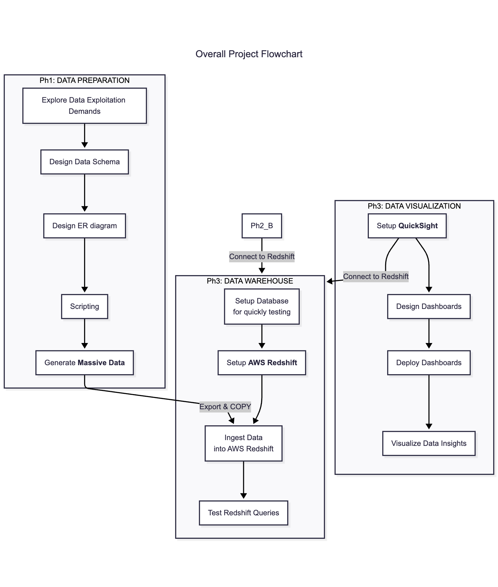

# DATA ENGINEERING REPORT LAYOUT

## I. Giới thiệu

> Trình bày **ngữ cảnh** của đề tài. 
> Trình bày **các bên liên quan** đến đề tài (đặc biệt là người dùng), cùng với **các yêu cầu nghiệp vụ** và **nhu cầu khai thác dữ liệu**, định hình ứng dụng khai thác dữ liệu từ lĩnh vực ứng dụng được yêu cầu.  

Theo [Statista](https://www.statista.com/statistics/379046/worldwide-retail-e-commerce-sales/), và nhiều trang đưa tin về các số liệu dự báo liên quan đến thị trường thương mại điện tử năm nay (2025) và những năm kế tiếp (đến 2030), ngành Thương mại điện tử (E-Commerce) nói chung và bán lẻ nói riêng sẽ đạt doanh thu lên đến 8 trăm tỉ đô.

Nên có thể nói, thị trường Thương mại điện tử vẫn còn là một thị trường lớn, chưa hạ nhiệt bất kể nền kinh tế thị trường toàn thế giới có nhiều biến động.

Do đó, với những giá trị doanh số ước tính đó, những doanh nghiệp trong ngành Thương mại điện tử cũng phải đối mặt với nhiều thách thức và vấn đề. Không chỉ liên quan đến vận hành các sàn giao dịch, điều phối logistic, giao nhận các đơn hàng, các chiến dịch địa phương,... Bên cạnh việc vận hành hệ thống cho các xử lý giao dịch, cập nhật dữ liệu liên tục, lớn, mà còn có thể gặp nhiều thách thức trong việc xử lý các dữ liệu lớn, để qua đó không ngừng cung cấp nhiều hoạt động khác cho khách hàng, tìm hiểu xu hướng thị trường, quản lý chất lượng sản phẩm, phát hiện và xử lý các bất thường trong giao dịch,... từ nguồn dữ liệu đến từ hệ thống được vận hành và chạy liên tục.

Qua đó, lấy bối cảnh là một doanh nghiệp vận hành một sàn thương mại điện tử, nơi có tốc độ data-scale lớn, các dữ liệu tập trung để phân tích nhiều, nên rất cần một hệ thống có thể đáp ứng được tốc độc truy vấn khổng lồ mà nhiều Hệ quản trị cơ sở dữ liệu quan hệ - Relational Database Management System (RDBMS) khó đáp ứng được - là một kho dữ liệu (Data Warehouse) như Amazon Redshift.

Amazon Redshift là một trong những lựa chọn tuyệt vời và thích hợp để xử lý bài toán phân tích dữ liệu lớn, hỗ trợ doanh nghiệp đưa ra các quyết định dựa trên dữ liệu (data-driven) với độ trễ thấp, độ ổn định cao, và khả năng truy vấn mạnh mẽ, đặc biệt khi xử lý hàng triệu, thậm chí hàng trăm triệu bản ghi.

Với bối cảnh đó, các bên liên quan (trực tiếp hoặc gián tiếp) tham gia vào hệ thống xử lý và phân tích dữ liệu trên sàn thương mại điện tử này (sau đây gọi tắt là hệ thống), bao gồm các bên với yêu cầu nghiệp vụ như bảng bên dưới:

| Stakeholders             | Vai trò                                             | Yêu cầu nghiệp vụ |
| ------------------------ | --------------------------------------------------- | ----------------- |
| Data Analysis            | Phân tích dữ liệu (chính)                           | xxx               |
| Business Manager         | Quyết định chiến lược                               | xxx               |
| Operation Team           | Vận kho, điều phối quản lý sản phẩm                 | xxx               |
| Khách hàng (Consumer) | Người tham gia mua sắm và thực hiện giao dịch    | xxx               |
| Nhà bán hàng (Seller) | Đăng ký và cung cấp hàng hóa cho nhu cầu mua sắm | xxx               |
| Developer team           | Phát triển và bảo trì hệ thống                      | xxx               |

Từ đó, hệ thống muốn trình bày và đưa ra một số nhu cầu liên quan đến khai thác dữ liệu, có liên quan và được sử dụng trực tiếp hoặc gián tiếp từ các bên liên quan kể trên như:

| #   | Nhu cầu KTDL                         | Mô tả |
| --- | ------------------------------------ | ----- |
| 1   | Phân tích doanh thu YoY hoặc MoM     | xxx   |
| 2   | Phân tích và quản lý tồn kho         | xxx   |
| 3   | Phân tích hiệu suất bán hàng         | xxx   |
| 4   | Phân tích và báo cáo theo địa lý     | xxx   |
| 5   | Phân tích đánh giá sản phẩm          | xxx   |
| 6   | Phân tích hiểu quả danh mục sản phẩm | xxx   |

## II. Nguồn dữ liệu

> Trình bày các nguồn dữ liệu dự kiến, các đặc điểm dữ liệu cần được lưu ý khi thực hiện kỹ thuật dữ liệu.  
> Có thể trình bày cách tổ chức dữ liệu, thiết kế dữ liệu, [ER Diagram](dbml/e_commerce_redshift.dbml). (tầng luận lý)    
> Có cần trình bày thiết kế DB ở tầng ý niệm không ?

## III. Giải pháp kỹ thuật dữ liệu

> Trình bày các giải pháp kỹ thuật dữ liệu, liên quan và dựa trên các nhu cầu khai thác dữ liệu và đặc tính của dữ liệu ở 2 phần trên.  
> Dự đoán sẽ trình bày cách phân tích yêu cầu dữ liệu, để thiết kế các câu truy vấn.  
>
> Giới thiệu ít nhất 1 giải pháp thay thế (đối sánh).  

## IV. Công nghệ quản lý dữ liệu

> Trình bày công nghệ được phân công cho quản lý dữ liệu, công nghệ tự chọn cho xử lý dữ liệu, và các dự định khai thác công nghệ cho ứng dụng.  

## V. Triển khai

> Trình bày cách triển khai ứng dụng dựa trên để tài lựa chọn và công nghệ được giao.  
> Bối cảnh: E-Commerce.  
> Công nghệ: Data Warehouse - Amazon Redshift.  
> Flowchart: [Overall Flow](../flowcharts/overall_flow.mmd)

## VI. Đánh giá

> Tính đúng đắn của dữ liệu sau khi kỹ thuật dữ liệu được thực hiện.  
> Hiệu suất của giải pháp kỹ thuật dữ liệu.  
> Hiệu quả của việc hỗ trợ khai thác dữ liệu thông qua ứng dụng.  
